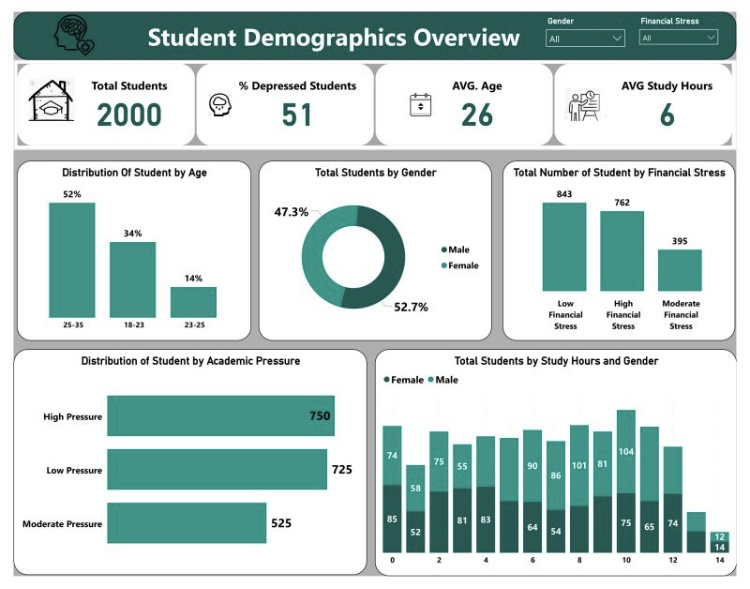
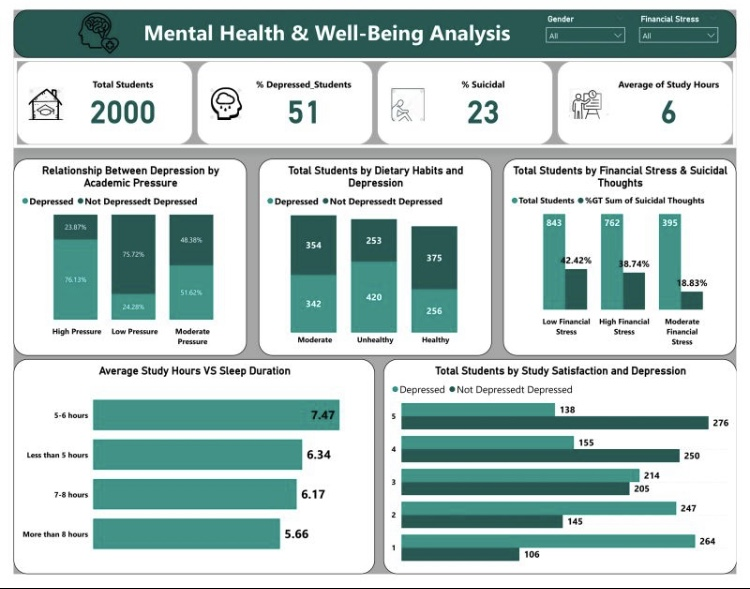

### 🎓 **Student Well-Being Dashboard: The Impact of Depression,Financial Stress&Sleep Deprivation**  

## 🏆 **Proud to Announce: Our Team Ranked 4th in the Digitaley Drive Hackathon!** 🚀  

This project was developed as part of the **Digitaley Drive Hackathon**, where my team explored the effects of **depression, financial stress, and sleep deprivation on academic performance**. Using **Power BI**, we built an interactive dashboard to visualize trends, uncover insights, and recommend solutions to improve student well-being.  

---
## 📌 **Introduction**  

Student well-being is a critical factor in **academic performance, personal development, and overall quality of life**. In today’s fast-paced educational environment, students face immense pressure that affects their mental, emotional, and physical health. This project analyzes three key factors:  

- **Depression** 😞: A growing concern among students, affecting motivation, concentration, and academic success.  
- **Financial Stress** 💰: Managing tuition fees, rent, and living expenses can be overwhelming, leading to anxiety and reduced academic performance.  
- **Sleep Deprivation** 💤: Long study hours, academic pressure, and part-time jobs contribute to poor sleep habits, affecting cognitive function and retention.  

By understanding these relationships, **institutions can take steps to enhance student support services, reduce stress, and improve overall well-being.**  

---

## 📊 **Data Collection & Cleaning**  

- **Source:** The dataset was obtained from **Kaggle**. 📥  
- **Data Cleaning:** Performed in **Power BI Query Editor**, handling missing values and ensuring consistency. 🛠️  
- **Processing:** Selected relevant columns, removed duplicates, and categorized financial stress levels for better visualization.  

---

## 📈 **Measures & Visualizations**  

To enhance analytical power, several **DAX measures** were created in **Power BI**, including:  

✅ **Total Students Count** 🎓  
✅ **Average Age of Students** 📅  
✅ **Average Study Hours** 📖  
✅ **Percentage of Depressed Students** 😟  
✅ **Student Distribution by Financial Stress Group** 💰  

### **Visualizations Include:**  
✔ **Bar Charts** – Age & Financial Stress Distribution  
✔ **Pie Chart** – Gender Ratio  
✔ **Column Charts** – Study Hours Segmentation  
✔ **Horizontal Bar Charts** – Academic Pressure Levels  

---

## 🔍 **Key Insights**  

### **Financial Stress Impact:**  
- A significant portion of students experience high financial stress, potentially lowering academic performance.  

### **Age Distribution:**  
- The majority of students fall within the **25-35 age range**, indicating a large population of adult learners.  

### **Study Hours & Gender Differences:**  
- Male and female students show variations in study hours, with some groups putting in more effort.  

### **Academic Pressure:**  
- A considerable number of students face high academic pressure, potentially contributing to mental health concerns.  

---

## 💡 **What We Achieved**  

✔ **Advanced data cleaning & analysis** using Power BI  
✔ **Interactive visualizations** to tell a compelling story  
✔ **Actionable recommendations** backed by data  

---

## 🔹 **My Role & Contributions**  

- Researched and selected the dataset for analysis  
- Performed **data cleaning and transformation** to ensure accuracy  
- Designed **interactive Power BI dashboards** to highlight key insights  
- Worked on **data condition columns and formatting**  
- Assisted in drawing conclusions and recommendations for student well-being  

This project **challenged me**, but I pushed through every difficulty. It reinforced my **passion for data analytics, visualization, and research-driven insights**.  

---

## ✅ **Recommendations**  

🔹 **Support for Financially Stressed Students:** Institutions should implement **financial aid programs** and **scholarships**. 💸  
🔹 **Mental Health & Well-being Programs:** Counseling services and **stress management workshops** can help students cope with academic and financial stress. 🧠  
🔹 **Flexible Learning Options:** Given the diverse age group, offering **flexible study schedules** could enhance learning experiences. ⏳  
🔹 **Encouraging Study Groups:** Peer collaboration can **improve academic performance** and reduce pressure. 🤝  

---

## 📂 **Project Files & Dashboard**  

📌 **Power BI Dashboard & Report**: 

